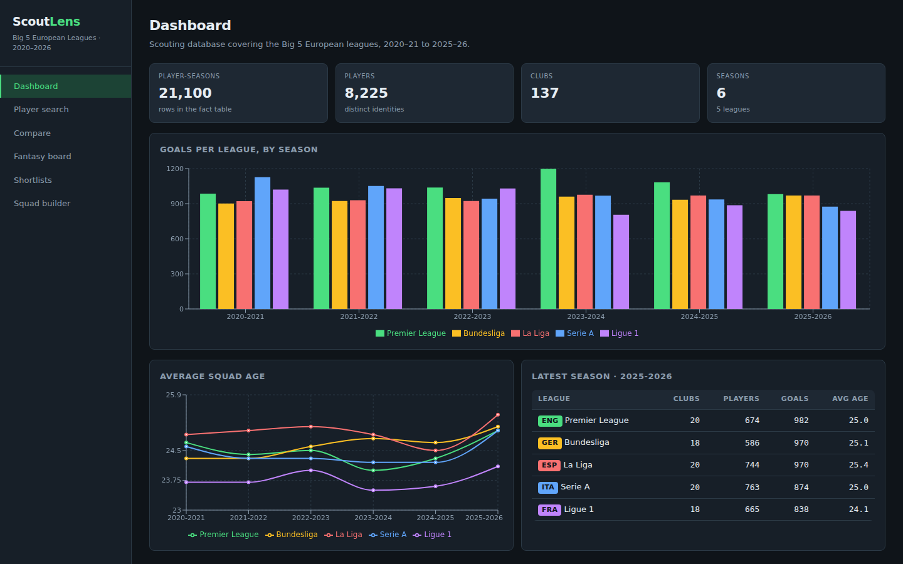

# ScoutLens

A football scouting and fantasy-analytics application over the **Big 5
European leagues**, 2020-21 to 2025-26 — 21,100 player-seasons, 8,225 players,
137 clubs, built on a normalised MySQL database.

The dataset ships as one 85-column CSV scraped from FBref. ScoutLens converts
it into a 22-table relational schema and puts a REST API and a
form-driven React interface on top.



## Stack

| Layer | Technology |
|---|---|
| Database | **MySQL 8.0** (MariaDB 10.6+ also works) — 22 tables, 6 views, 6 stored routines, 2 triggers |
| Backend | **Node.js + Express** — REST API, parameterised queries built from filter selections |
| Frontend | **React (Vite)** with plain CSS — filter builder, comparison tables, dashboards |
| Charts | Recharts |
| ETL | Node script converting the source CSV into the schema, plus a generator that emits plain `.sql` seed files |

All statistics are computed **in the database**. The API validates input and
translates filter selections into SQL; it does not recompute aggregates in
JavaScript.

## Features

- **Player search** — a filter builder over 21 whitelisted fields with
  `is` / `at least` / `at most` / `between` / `is one of` / `contains`
  operators, sortable and paginated results.
- **Player profiles** — career totals, season-by-season trend charts, and
  season-over-season deltas computed with SQL window functions.
- **Head-to-head comparison** — any two player-seasons side by side with a
  per-90 radar, better values highlighted.
- **Fantasy leaderboard** — points computed in MySQL from a configurable
  scoring ruleset; switching ruleset re-scores all 21,100 rows on the spot.
- **Shortlists** — save scouting targets with a rating and notes.
- **Squad builder** — pick a fantasy squad from one season; size, captaincy and
  season-consistency rules enforced by database triggers.
- **League dashboard** — goals, squad ages and club counts per league per season.

## Quick start

### Prerequisites

- Node.js 18+
- MySQL 8.0 or MariaDB 10.6+ running locally

### 1. Create the database user

```sql
CREATE DATABASE IF NOT EXISTS scoutlens;
CREATE USER 'scoutlens'@'localhost' IDENTIFIED BY 'scoutlens';
GRANT ALL PRIVILEGES ON scoutlens.* TO 'scoutlens'@'localhost';
FLUSH PRIVILEGES;
```

Creating routines and triggers also needs `SUPER` or
`log_bin_trust_function_creators = 1`, which is the default on a local install.

### 2. Configure and install

```bash
cp .env.example .env       # edit if your MySQL differs
npm run install:all        # installs root, server and client dependencies
```

### 3. Build the database

```bash
npm run db:setup
```

That runs three steps, which can also be run individually:

```bash
npm run db:schema   # db/schema/*.sql  — tables, keys, indexes
npm run db:import   # data/*.csv       — loads 21,100 rows
npm run db:logic    # db/logic/*.sql   — views, rules, procedures, triggers, scoring
```

Takes about 12 seconds end to end and prints what it loaded:

```
  players: 8,225 distinct identities
  player_seasons: 21,100 rows (skipped 0 unmappable, 0 duplicate)
  stats: 17,149 standard, 17,149 shooting, 1,233 keeper, 21,100 playing-time, 17,149 misc
```

### 4. Run it

Two terminals:

```bash
npm run server     # Express API on http://localhost:4000
npm run client     # React app  on http://localhost:5173
```

Open <http://localhost:5173>. The Vite dev server proxies `/api` to Express, so
there is no CORS setup during development.

Verify the whole stack at any time:

```bash
node scripts/smoke-test.mjs     # 24 checks across every route group
```

## Loading from SQL only

If you would rather not run the Node importer — for example when marking the
project from MySQL Workbench — `db/seed/` holds the same data as plain
`INSERT` statements, generated by `npm run db:export`:

```bash
mysql -u scoutlens -p < db/schema/01_schema.sql
mysql -u scoutlens -p < db/schema/02_stats.sql
mysql -u scoutlens -p < db/schema/03_fantasy_app.sql
cat db/seed/*.sql   | mysql -u scoutlens -p
cat db/logic/*.sql  | mysql -u scoutlens -p
```

Both routes produce an identical database. The `.sql` files use `DELIMITER`
directives so they open and run in MySQL Workbench unchanged.

## Project layout

```
data/                     source CSV (vendored from the dataset repo)
db/
  schema/                 DDL: dimensions, fact, stat categories, app tables
  logic/                  views, scoring rules, procedures, triggers
  seed/                   generated INSERT statements (5.9 MB)
etl/
  import.js               CSV → MySQL loader
  parse.js                field cleaning: age, nation, league, name folding
  sql-split.js            DELIMITER-aware statement splitter
  export-seed.js          database → db/seed/*.sql
  run-sql.js              runs a directory of .sql files in order
server/src/
  db/pool.js              connection pool
  lib/filters.js          filter whitelist → parameterised WHERE clause
  routes/                 meta, players, analytics, scouting
client/src/
  components/             FilterBuilder, ResultsTable, shared bits
  pages/                  Dashboard, Search, Player, Compare, Leaderboard,
                          Shortlists, Squad builder
scripts/smoke-test.mjs    end-to-end API checks
docs/                     SCHEMA.md, DATA.md, API.md
```

## How the filter form reaches SQL

This is the part worth reading. Filter selections are translated server-side in
`server/src/lib/filters.js`:

```js
{ field: 'goals', op: 'gte', value: 10 }
        ↓  looked up in FILTER_FIELDS whitelist
"vps.goals >= ?"  +  params: [10]
```

Field names are **looked up** in a whitelist, never concatenated from user
input; only the resolved column name reaches the SQL string. Every value
travels as a `?` placeholder. An unknown field or a disallowed operator is
rejected with `400`:

```
Unknown filter field: "goals; DROP TABLE players"
Operator "like" is not allowed on "goals" (allowed: gte, lte, between)
```

The same whitelist is published through `GET /api/meta`, so the React filter
builder renders its dropdowns from it and cannot offer a filter the API would
reject.

## Notes on the data

The source CSV needed real cleaning, documented in full in
[docs/DATA.md](docs/DATA.md). The three that shaped the schema:

- **3,951 rows look empty but are not.** They are unused substitutes whose
  league, nation and position live in the `_playing_time` columns rather than
  the base ones. Coalescing across the variants recovers a league for 100% of
  rows; dropping them would have deleted exactly the players a "who is not
  getting minutes" query is looking for.
- **Player names are not unique.** 49 names belong to two different people —
  including two Alberto Lópezes at Sevilla in the same season. Identity is
  `(name, birth year)`.
- **One player is spelled two ways.** `Álvaro Cortés` and `Alvaro Cortes` are
  the same Barcelona player in consecutive seasons, and MySQL's collation
  considers them equal. The importer folds names the same way the collation
  does, so he has one career instead of two half-populated ones.

**Known limitation:** FBref only publishes clean sheets for goalkeepers, so
defender clean-sheet points score zero. The rules exist in
`fantasy_scoring_rules` and will start scoring if team-level match results are
added. See [docs/DATA.md](docs/DATA.md#known-limitation-clean-sheets).

**Note on 2025-26:** that season is a partial, in-progress scrape, so its
totals are lower than a completed season.

## Documentation

- [docs/SCHEMA.md](docs/SCHEMA.md) — tables, views, routines, triggers, indexing
- [docs/DATA.md](docs/DATA.md) — dataset provenance and every cleaning decision
- [docs/API.md](docs/API.md) — full endpoint reference

## Credits

Statistics from the
[FOOTBALL_FANTASY_ML](https://github.com/adiburrahman2004/FOOTBALL_FANTASY_ML)
dataset by [@adiburrahman2004](https://github.com/adiburrahman2004), scraped
from [FBref](https://fbref.com/). Data is used here for educational purposes.
